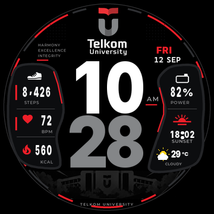
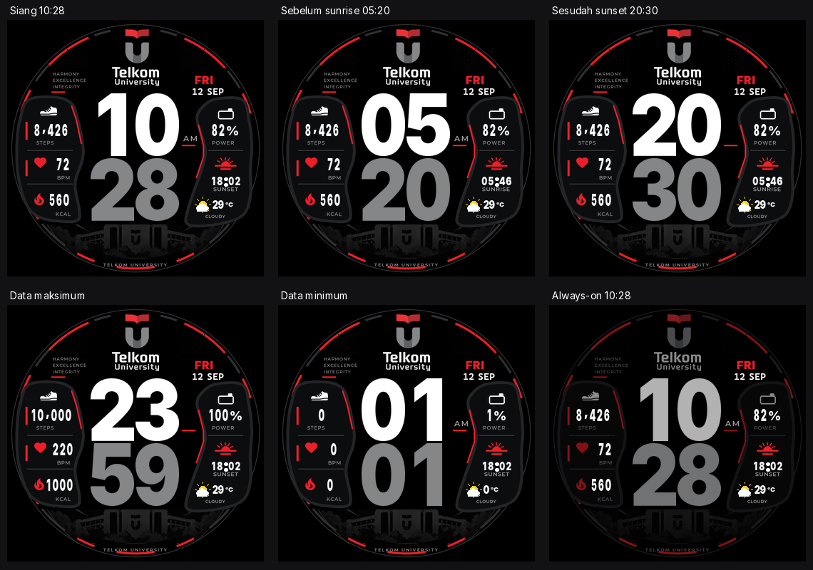
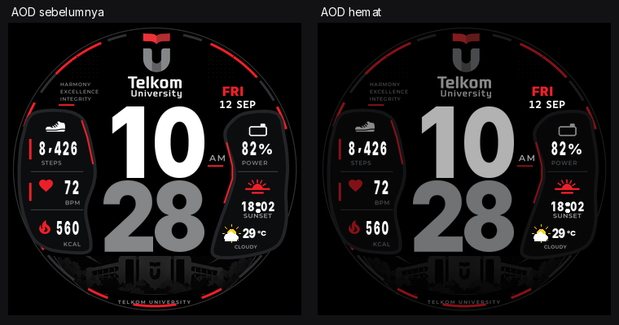

# TEL-U Performance V6

Watchface **Amazfit T-Rex Pro, 360 x 360** dengan jam putih dan menit abu-abu terang yang ditumpuk vertikal. Angka utama setinggi 88 piksel, panel aktivitas di kiri, serta baterai, solar, dan cuaca di kanan.



**[Unduh telu_university_v6.bin](out/telu_university_v6.bin)**, lalu gunakan alur pemasangan file lokal untuk T-Rex Pro yang sudah digunakan pada watchface sebelumnya. Paket ini memakai format legacy UIHH v2, bukan paket Zepp OS.

Build dan validasi software selesai. **Uji instalasi pada jam fisik masih pending**, termasuk kesesuaian preview, pergantian solar, cuaca, alignment metrik, dan konsumsi baterai AOD.

## Tampilan



Preview di atas dibuat dari parameter dan gambar yang diekstrak kembali dari BIN hasil build. Skenario solar dipilih secara eksplisit untuk memeriksa tata letak. Preview tersebut tidak membuktikan firmware sudah menjalankan transisi otomatis.

- Jam putih `#FFFFFF`, menit `#848688`, aksen Tel-U `#ED1E28`, latar hitam.
- Steps, BPM, kcal, baterai, tanggal, bulan, hari, AM/PM, suhu, dan 29 banner cuaca.
- Satu slot sunrise/sunset dengan mekanisme closest-event dari baseline.
- Always-on mempertahankan semua komponen, dengan digit besar dan background yang lebih redup.
- Digit memakai sel tetap, sehingga perubahan waktu tidak menggeser posisi pasangan angka.

[Lihat stress test waktu](out/time-stress.png) atau buka [preview interaktif](preview.html) di browser. Preview interaktif juga menyediakan gambar referensi, suhu negatif, dan ukuran tampilan 360 atau 720 piksel.

## Build ulang

Python dengan Pillow, svglib, dan reportlab. Versi yang dipakai tercatat di [requirements.txt](requirements.txt). Raster SVG memerlukan backend renderPM yang berfungsi pada instalasi reportlab.

```powershell
python tools/build_all.py
python -m unittest discover -s tools -p "test_*.py"
```

Perintah pertama menghasilkan aset, memeriksa batas lingkaran dan tabrakan, membuat preview internal 220 x 220, melakukan packing, memverifikasi BIN, lalu merender semua skenario dari hasil ekstraksi. Perintah kedua menjalankan 30 pengujian regresi, termasuk 2.604 kombinasi hari/tanggal/bulan, nilai metrik pendek dan panjang, suhu negatif, container perangkat, serta keutuhan komponen dan bentuk digit AOD.

Hasil utama:

| Berkas | Isi |
| --- | --- |
| `out/telu_university_v6.bin` | Paket untuk dipasang pada jam |
| `out/telu_trex_pro.bin` | Alias identik untuk kompatibilitas pipeline |
| `out/validation.json` | SHA-256, ukuran, container, dan hasil round-trip |
| `out/qa.json` | Snapshot audit penyerahan: test, sumber, codec, dan preview HTML |
| `out/scenarios.png` | Enam skenario wajib |
| `out/time-stress.png` | Sembilan waktu uji |
| `build/verified_bin/` | Parameter dan PNG hasil ekstraksi, dibuat saat build |

## Fondasi teknis

Repository ini berdiri sendiri, diadaptasi dari [telu-amazfit-trex-pro-watchface pada c7a48cc](https://github.com/fathahnoor/telu-amazfit-trex-pro-watchface/tree/c7a48cc81ba5a4607fd49bd92c742447765be021). Codec dan packer dipertahankan: UIHH v2, device ID 83, blok QuickLZ 4096 byte, kanal gambar BGRA, serta indeks firmware mulai dari 1. Repository lama tidak diubah.

`tools/gen_telu.py` menjadi sumber desain V6. `tools/check_round.py` dan `tools/check_layout.py` memvalidasi posisi semua varian. `tools/trexpro_wf.py`, `tools/pack_watchface.py`, dan `tools/verify_bin.py` menangani binary. `tools/render_mockup.py` menghasilkan preview.

Sumber visual pengguna tetap utuh di [spesifikasi V6](TELU_WATCHFACE_V6_DESIGN_SPEC.md) dan [V6-REF.png](V6-REF.png). Folder `v5/`, aset lama, dan `docs/reference/` adalah arsip baseline, bukan dokumentasi status V6. Penjelasan perubahan dan batas firmware ada di [catatan implementasi](docs/implementation-v6.md).

## Pemeriksaan di jam

Gunakan [checklist perangkat](docs/device-test.md) setelah memasang BIN. Keterbacaan pada jarak nyata dan kesesuaian render dengan firmware belum dapat dipastikan lewat simulator. AOD lengkap belum diukur konsumsi baterainya.

## Kredit

Fondasi teknis oleh [fathahnoor](https://github.com/fathahnoor), dengan skema UIHH dari [watchface-js](https://github.com/Nadeflore/watchface-js), GPL-3.0-only, sebagaimana dicatat dalam [atribusi baseline](tools/LICENSE.watchface-js). Font Inter dan Montserrat memakai SIL OFL; Cascadia Mono beserta [lisensinya](assets/fonts/LICENSE-CascadiaMono.txt) digunakan untuk tanggal. Ikon sepatu, hati, dan api berasal dari Material Design Icons, Pictogrammers. Logo Telkom University berasal dari Wikimedia Commons, karya Hilfans, CC BY-SA 4.0, dengan wordmark yang diputihkan. Ilustrasi kampus diadaptasi dari artwork V5 menjadi siluet gelap.

Proyek personal, bukan produk resmi Telkom University atau Amazfit. Tidak ada klaim lisensi tunggal yang menggantikan ketentuan aset dan komponen sumber.

## Optimasi AOD



Aset AOD dihitung saat build, tanpa menambahkan timer atau animasi pada jam. Semua metrik tetap tampil; mode normal tidak berubah. Penurunan sinyal RGB sekitar 28% merupakan ukuran gambar, bukan hasil ukur baterai. Detail, batas firmware, dan cara membandingkan baterai ada di [catatan AOD](docs/aod-power.md).
